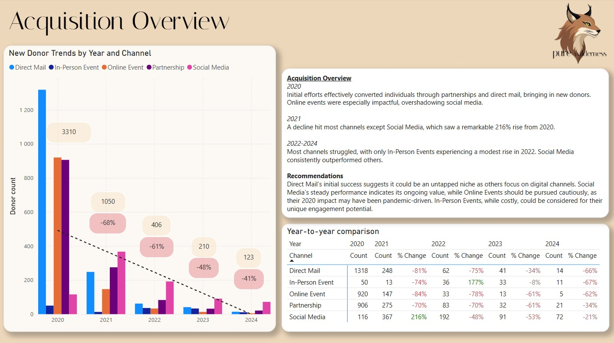
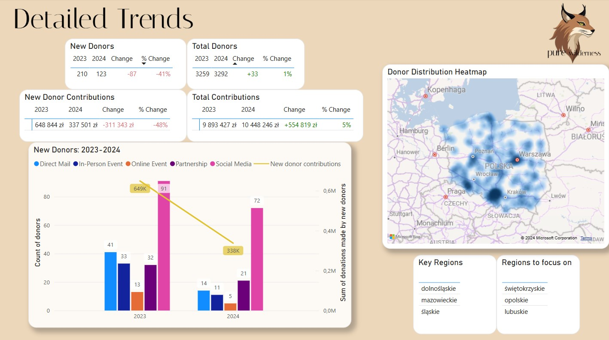
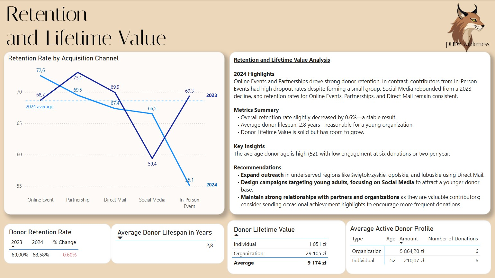
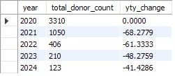
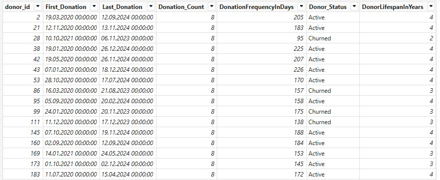

# Pure Wilderness Fundraising Efforts Analysis

## Project Screenshots

<br>



## Data Sources & Tools
- **Data**:
    - donor_data was generated using my custom Python script (code in repository)
    - list of cities was extracted from this stat website: [polskawliczbach.pl](https://www.polskawliczbach.pl/Miasta)
- **SQL tool**: MySQL Workbench 8.0 CE
- **Analytics and Visualization tool**: Power BI

## Project Background
Pure Wilderness is a wildlife conservation non-profit founded in 2020. Initially, the organization achieved significant success in attracting donors and relied on this initial pool for several years. However, by 2024, with donor numbers stagnating and new acquisitions limited, they are now seeking insights into donor retention, most effective acquisition channels, and potential opportunities for growth.

### Challenges:
- Extracting actionable insights from 5 years of data.

## Project Strategy
All individuals or entities that donated to the organization are referred to as 'donors'.

<details>
  <summary>📖 Data Dictionary</summary><br>

- **donor_id**: Unique ID  
- **donor_type**: Individual or Organization  
- **donation_dates**: Comma-separated donation dates  
- **donation_amounts**: Comma-separated donation amounts  
- **acquisition channel**: Source channel (Direct Mail, Online Event, etc.)  
- **age, gender, location**: Donor demographics  
</details>

### Main Steps (Technical)

1. **Data Modeling (SQL)**:
   - Normalized data across the *donors*, *don_details*, and *acquisition* tables.
   - Calculated metrics for cross-checking in Power BI.

2. **Power BI Analysis**:
   - Constructed the DonorSummary table, including metrics such as *First Donation*, *Last Donation*, *Donor Lifespan*, and *Donor Status*.
   - Developed additional metrics to make building visuals easier.

<details>
  <summary>📈 SQL Steps</summary>

#### Input Data (01_input.sql)
I created a **donors** table and inserted data into that table. Due to MySQL Workbench quirks, I had to import all fields except donor_id as varchars.

#### Modeling Data (02_modeling_data.sql)
I created a **don_details** table, separating donation_dates and donation_amounts into individual records. I assigned a donation ID (a unique identifier for each donation) and a donation number (an increasing integer identifying a donation within a single user scope). The code includes CASE statements to fix date formats. Since the donation_date field contains a varying number of dates (from 1 to 10), they were handled differently by Excel. Initially, all dates were in the format YYYY-MM-DD. After opening the file in Excel, single dates were automatically recognized as dates and converted into a format aligning with my Windows settings (MM.DD.YYYY), while strings of dates separated by commas remained intact. After separating all dates, the differences in formats caused issues when interpreting them in MySQL Workbench.

#### Dropping and Renaming Tables (03_dropping_and_renaming.sql)
I dropped the two columns containing donation information from the donors table and renamed the tables to reflect their contents.

#### Donor Retention Rate (04_donor_retention_rate.sql)
I calculated a donor retention rate to compare with Power BI calculations to verify their accuracy.

#### Acquisition Data (05_acquisition.sql)
I created a new table, **acquisition**, to show counts and percentage changes of donors, broken down by channels.

#### Yearly Difference Calculation (06_yty_change.sql)
Finally, I calculated the year-by-year difference in new donor counts, again to compare with Power BI metrics later.



</details>

<details>
  <summary>📈 Power BI Steps</summary>    

  <br>I imported the data into Power BI and created additional metrics, tables, and visuals. Below are some selected examples of important calculations; not all metrics or code pieces are described.

- **Donor Summary Table**  
  The date of the first donation was crucial for comparing against acquisition channels to assess performance. I created the DonorSummary table to extract the first donation date along with acquisition channel information, which was essential to understanding how each donor was acquired.

```plaintext
DonorSummary = 
SUMMARIZE(
    'donations',
    'donations'[donor_id],
    "First_Donation", MIN('donations'[donation_date]),
    "Last_Donation", MAX('donations'[donation_date]),
    "Donation_Count", MAX('donations'[donation_number])
)
```

- **Donor Status Calculation**  
  The Donor_Status was based on whether a donor made a donation in the last 365 days; if not, they were considered churned.

```plaintext
Donor_Status = IF(ROUND(DATEDIFF(DonorSummary[Last_Donation], DATE(2024,12,31), DAY),0) > 365, "Churned", "Active")
```

- **Donor Lifespan in Years**  
  DonorLifespanInYears was calculated using both active and churned donor data. The logic is that if a customer is active, the formula calculates their lifespan as years passed since the first donation to the end of 2024. If churned, the lifespan is the difference between the first and last donation.

```plaintext
DonorLifespanInYears = IF(DonorSummary[Donor_Status] = "Active", 
    DATEDIFF(DonorSummary[First_Donation], DATE(2024,12,31), YEAR), 
    DATEDIFF(DonorSummary[First_Donation], DonorSummary[Last_Donation], YEAR))
```

- **Donation Frequency in Days**  
  DonationFrequencyInDays is a calculated column showing the average number of days between each donation for each donor.

```plaintext
DonationFrequencyInDays = ROUND(DATEDIFF(DonorSummary[First_Donation], DonorSummary[Last_Donation], DAY) / DonorSummary[Donation_Count], 0)
```



</details>

### Main Steps (Analytical)   

**One Metric That Matters**  
- Donor Count  

**North Star Metrics**  
- Donor Retention Rate  
- Lifetime Value (LTV)  

**Dimensions**  
- Acquisition Channel  
- Donor Type  

I divided my visuals into three dashboards.

**Acquisition Overview**  
This section illustrates how the foundation's strong initial efforts at donor acquisition dwindled over the five years of operation.

**Detailed Trends**  
Here, I focused on a comparison between 2023 and 2024, along with insights into donors' geographical locations.

**Retention and Lifetime Value**  
This part examines which acquisition channels attract donors who are more likely to remain engaged. I also included additional metrics, such as lifespan and lifetime value, to provide a comprehensive overview of the situation.

## Summary of Insights

### Acquisition Overview

#### 2020
Initial efforts effectively converted individuals through partnerships and direct mail, bringing in new donors. Online events were especially impactful, overshadowing social media.

#### 2021
A decline hit most channels except Social Media, which saw a remarkable **216%** rise from 2020.

#### 2022-2024
Most channels struggled, with only In-Person Events experiencing a modest rise in 2022. Social Media consistently outperformed others.

### Recommendations
- Direct Mail’s initial success suggests it could be an untapped niche as others focus on digital channels. 
- Social Media’s steady performance indicates its ongoing value, while Online Events should be pursued cautiously, as their 2020 impact may have been pandemic-driven.
- In-Person Events, while costly, could be considered for their unique engagement potential.

---

## Retention and Lifetime Value Analysis

### 2024 Highlights
Online Events and Partnerships drove strong donor retention. In contrast, contributors from In-Person Events had high dropout rates despite forming a small group. Social Media rebounded from a 2023 decline, and retention rates for Online Events, Partnerships, and Direct Mail remain consistent.

### Metrics Summary
- Overall retention rate slightly decreased by **0.6%**—a stable result.
- Average donor lifespan: **2.8 years**—reasonable for a young organization.
- Donor Lifetime Value is solid but has room to grow.

### Key Insights
The average donor age is high (**52**), with low engagement at six donations or two per year.

### Recommendations
- Expand outreach in underserved regions like **świętokrzyskie, opolskie**, and **lubuskie** using Direct Mail.
- Design campaigns targeting young adults, focusing on Social Media to attract a younger donor base.
- Maintain strong relationships with partners and organizations as they are valuable contributors; consider sending occasional achievement highlights to encourage more frequent donations.

## Next Steps

- Provide the costs associated with each acquisition channel to calculate ROI by channel.
- Share the numbers of campaigns and their corresponding dates for further analysis, allowing for a more comprehensive understanding of their impact.

